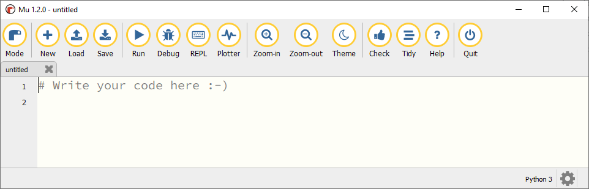

Voorbereiding
=============

Om te kunnen programmeren heb je een *programmeeromgeving* nodig: een programma waarin je code kunt typen en kunt laten uitvoeren. In deze cursus gebruiken we daarvoor `Mu editor <https://codewith.mu/>`_. Nadat je Mu editor hebt gestart, ga je de benodigde vensters handig rangschikken op je scherm en je eerste programma maken.

Mu editor starten
-----------------
Start Mu editor via de Windows Startknop linksonder in je scherm.

.. grid:: 2

    .. grid-item::
        :columns: auto

        .. image:: ../images/windows_start.png
            :height: 39px

    .. grid-item::
        :columns: auto

        .. image:: ../images/mu_windows_start.png
            :height: 36px

Controleer nadat je Mu editor hebt opgestart, dat rechtsonder in de statusbalk Python 3 staat. Als er iets anders staat, klik dan op de Mode knop en selecteer Python 3.

Vensters rangschikken
---------------------
Je hebt nu minstens twee vensters open op je scherm: het venster van de webbrowser waarin je deze tekst leest en het Mu editor venster. Rangschik deze vensters op de volgende manier:

.. tab-set:: 

    .. tab-item:: Stap 1

        Pak met je muis het venster van Mu editor vast bij de balk aan de bovenkant en sleep het venster naar de linkerkant van het scherm totdat de muiscursor de schermrand raakt. Je ziet dan een soort schaduwvenster verschijnen dat de gehele linkerhelft van het scherm beslaat.
        
        .. image:: ../images/windows_arrange_1_small.png

    .. tab-item:: Stap 2

        Laat de muisknop los en voilà, het venster van Mu editor neemt precies de linkerhelft van het scherm in.

        .. image:: ../images/windows_arrange_2_small.png

    .. tab-item:: Stap 3

        Mogelijk suggereerde Windows bij de vorige stap na het loslaten van de muisknop al een venster om op de rechterhelft van het venster te plaatsen. In dat geval klik je op het venster van je webbrowser. Als Windows geen suggestie deed, sleep je zelf het venster van je webbrowser naar de rechterrand van het scherm om het op de rechterhelft te plaatsen.

        

Je eerste programma
-------------------
