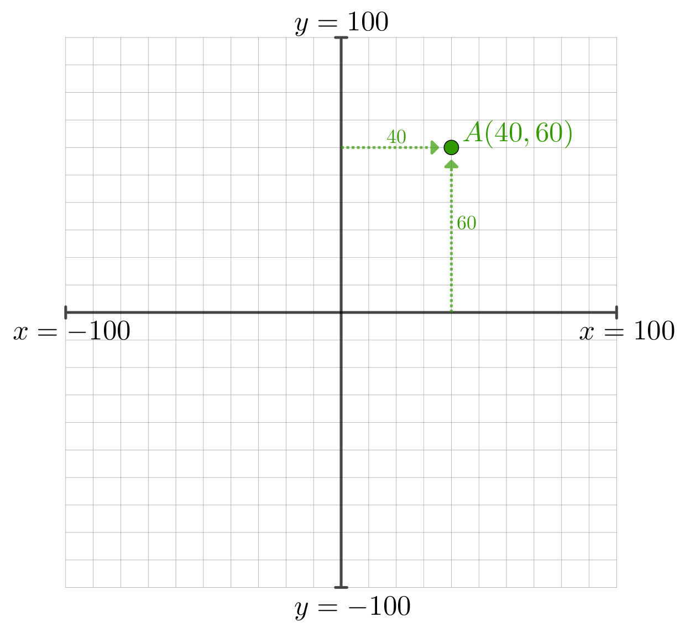
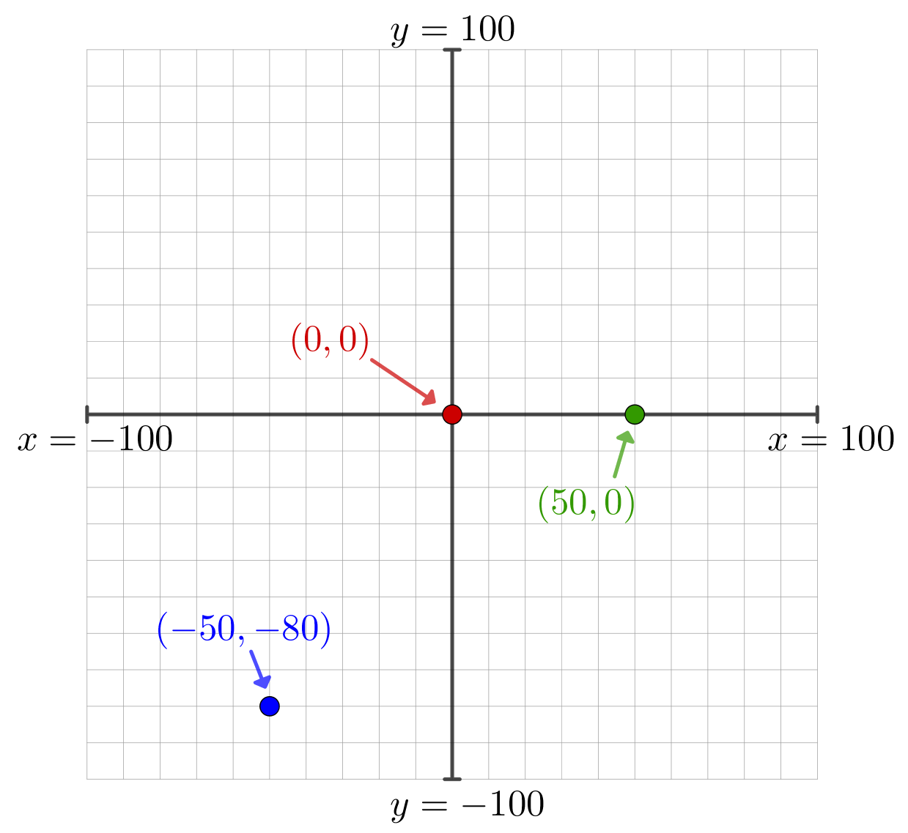
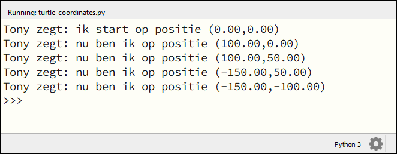
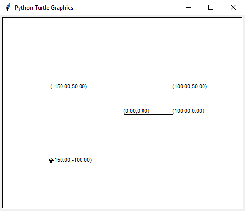
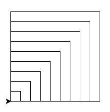

.. role:: python(code)
   :language: python

Coördinaten
===========

Tot nu toe bewoog je de turtle met de functies :python:`turtle.fd()` en :python:`turtle.bk()` een aantal pixels vooruit of achteruit. En met :python:`turtle.lt()` en :python:`turtle.rt()` kon je de turtle laten draaien om vervolgens een andere richting in te slaan. Maar soms is het handiger de turtle in één keer naar een bepaalde plek in het venster te sturen. Bijvoorbeeld naar de hoek linksonder, of naar het middelpunt. Dat kun je doen door *coördinaten* te gebruiken.

Coördinaten zijn getallen die aangeven waar een punt ligt in een vlak. Wellicht ben je al bekend met geografische coördinaten die we gebruiken om plaatsen op de wereldkaart aan te duiden. Op `Google Maps <https://maps.google.nl>`_ kun je bijvoorbeeld de coördinaten van Gymnasium Beekvliet in Sint-Michielsgestel vinden: (51.642174818007355, 5.3640463837966434).

Assenstelsel
------------

Om met coördinaten te werken, heb je een assenstelsel nodig. Meestal gebruiken we een horizontale x-as en een verticale y-as.

Elk punt in het vlak kun je vervolgens aangeven met een x-coördinaat en een y-coördinaat. In de afbeelding hierboven zie je dat het punt A de coördinaten (40, 60) heeft, omdat je op de x-as 40 naar rechts gaat en op de y-as 60 omhoog. Coördinaten noteer je altijd tussen ronde haakjes: (x, y).

Hieronder zie je de coördinaten van drie andere punten in het vlak. Het punt (0, 0) noemen we ook wel de *oorsprong* van het assenstelsel. Het punt (50, 0) bereik je door vanuit de oorsprong 50 naar rechts te gaan en 0 omhoog. De mintekens bij de coördinaten (-50, -80) geven aan dat je vanuit de oorsprong 50 naar links gaat en 80 omlaag.

Coördinaten en turtle
---------------------

In Python kun je met de volgende functies de coördinaten van de turtle opvragen:

.. list-table::
    :header-rows: 1

    * - Functie
      - Werking 
    * - :python:`turtle.pos()`
      - Geeft de positie (x, y) van de turtle terug. 
    * - :python:`turtle.xcor()`
      - Geeft de x-coördinaat van de turtle terug. 
    * - :python:`turtle.ycor()`
      - Geeft de y-coördinaat van de turtle terug. 

Kopieer de volgende code in een nieuw Mu editor bestand met de naam :file:`turtle_coordinates.py` en kijk wat er gebeurt.

.. code-block:: python
    :linenos:
    :caption: turtle_coordinates.py
    :name: turtle_coordinates_v01

    import turtle

    # Gebruik een turtle op de laagste snelheid
    tony = turtle.Turtle()
    tony.speed(1)

    # Beweeg de turtle en print de positie.
    print("Tony zegt: ik start op positie", tony.pos())
    tony.fd(100)
    print("Tony zegt: nu ben ik op positie", tony.pos())
    tony.lt(90)
    tony.fd(50)
    print("Tony zegt: nu ben ik op positie", tony.pos())
    tony.lt(90)
    tony.fd(250)
    print("Tony zegt: nu ben ik op positie", tony.pos())
    tony.lt(90)
    tony.fd(150)
    print("Tony zegt: nu ben ik op positie", tony.pos())

Op regels 4 en 5 wordt de turtle aangemaakt en de snelheid op 1 gezet, zodat je goed kunt volgen wat er gebeurt. Met de functie :python:`print()` in regel 8 tonen we de huidige positie van tony in Mu editor (onder je code). Vervolgens gaat tony bewegen en wordt telkens de positie afgedrukt.

Met :python:`print()` druk je iets af in het Mu editor venster, maar misschien vind je het handiger om de code in het turtle venster te zien. Dat kan met de functie :python:`turtle.write()`. 

.. list-table::
    :header-rows: 1

    * - Functie
      - Werking 
    * - :python:`turtle.write(text)`
      - Schrijft de waarde van de variabele :python:`text` in het tekenvenster. 

Vervang de :python:`print()` statements in de regels 8, 10, 13, 16 en 19 in :file:`turtle_coordinates.py` door de aanroep :python:`tony.write(tony.pos())`.

.. code-block:: python
    :linenos:
    :emphasize-lines: 8, 10, 13, 16, 19
    :caption: turtle_coordinates.py
    :name: turtle_coordinates_v02

    import turtle

    # Gebruik een turtle op de laagste snelheid
    tony = turtle.Turtle()
    tony.speed(1)

    # Beweeg de turtle en print de positie.
    tony.write(tony.pos())
    tony.fd(100)
    tony.write(tony.pos())
    tony.lt(90)
    tony.fd(50)
    tony.write(tony.pos())
    tony.lt(90)
    tony.fd(250)
    tony.write(tony.pos())
    tony.lt(90)
    tony.fd(150)
    tony.write(tony.pos())

Nu schrijft tony de coördinaten tijdens het tekenen.

Tekenen met coördinaten
-----------------------

De coördinaten van de turtle opvragen is aardig, maar het wordt nog leuker als je de turtle ook naar bepaalde coördinaten toe kunt sturen. Daarvoor gebruik je de functie :python:`turtle.goto(x, y)`. De Nederlandse vertaling van 'go to' is 'ga naar'.

.. list-table::
    :header-rows: 1

    * - Functie
      - Werking 
    * - :python:`turtle.goto(x, y)`
      - Beweegt de turtle naar de positie (:python:`x`, :python:`y`).

Vervang de code in :file:`turtle_coordinates.py` door het onderstaande programma om de functie :python:`goto()` in actie te zien.

.. code-block:: python
    :linenos:
    :caption: turtle_coordinates.py
    :name: turtle_coordinates_v03

    import turtle

    tony = turtle.Turtle()

    tony.goto(100, 0)
    tony.goto(100, 100)
    tony.goto(0, 100)
    tony.goto(0, 0)

Wow, in plaats van 7 instructies (4 keer :python:`turtle.fd(100)` en 3 keer :python:`turtle.lt(90)`) hebben we nu nog maar 4 instructies nodig om een vierkant te tekenen!

.. dropdown:: Opdracht 01
    :color: secondary
    :icon: pencil

    Maak een nieuw bestand in Mu editor met de naam :file:`tony_coordinates.py`. Schrijf daarin een programma dat onderstaande tekening maakt.

    .. figure:: images/tony_coordinates_output.png

    De coördinaten van de hoekpunten kun je aflezen in de onderstaande figuur.

    .. figure:: images/tony_coordinates.png

    .. dropdown:: Tip
        :color: secondary
        :icon: light-bulb
        :open:

        Bij deze opdracht moet je heel vaak :python:`tony.goto()` aanroepen. Om het typwerk te versnellen kun je handig *copy paste* (kopiëren en plakken) gebruiken. Typ in Mu editor de regel :python:`tony.goto()`, selecteer de zojuist getypte tekst met de muis en druk op :kbd:`Ctrl` + :kbd:`C` om te kopiëren. Ga naar de volgende regel en druk op :kbd:`Ctrl` + :kbd:`V` om te plakken. Herhaal :kbd:`Ctrl` + :kbd:`V` om in een mum van tijd regels met :python:`tony.goto()` te vullen. Daarna hoef je alleen nog de coördinaten tussen de haakjes in te vullen.

        .. image:: images/copy_paste.png

    Weet je niet hoe je moet beginnen? Open dan Hint 1 hieronder. Daarin wordt de code voor de rode letter T gegeven.

    .. dropdown:: Hint 1
        :color: secondary
        :icon: light-bulb

        Dit is de code om de letter T te tekenen: 

        .. code-block:: python
            :linenos:
            :caption: tony_coordinates.py
            :name: tony_coordinates

            import turtle

            tony = turtle.Turtle()
            tony.shape('circle')

            # Teken de letter T
            tony.pencolor("red")
            tony.fillcolor("red")
            tony.penup()
            tony.goto(-400, 150)
            tony.pendown()
            tony.begin_fill()
            tony.goto(-400, 100)
            tony.goto(-350, 100)
            tony.goto(-350, 0)
            tony.goto(-300, 0)
            tony.goto(-300, 100)
            tony.goto(-250, 100)
            tony.goto(-250, 150)
            tony.goto(-400, 150)
            tony.end_fill()

            # Teken de letter O

    .. dropdown:: Hint 2
        :color: secondary
        :icon: light-bulb

        De letter O bestaat eigenlijk uit twee vierkanten: een groot blauw vierkant met een kleiner wit vierkant erin. Teken eerst het blauwe en daarna het witte vierkant.

Door coördinaten in loops te gebruiken, kun je leuke effecten bereiken. Probeer het onderstaande maar eens.

.. code-block:: python
    :linenos:
    :caption: turtle_coordinates.py
    :name: turtle_coordinates_v04

    import turtle

    tony = turtle.Turtle()

    for z in range(10):
        tony.goto(20*z, 0)
        tony.goto(20*z, 20*z)
        tony.goto(0, 20*z)
        tony.goto(0, 0)

De for loop zorgt ervoor dat 10 vierkantjes worden getekend. De eerste met zijden van 20 pixels, de volgende met zijden van 40 pixels, dan 60 pixels, enzovoort.

.. dropdown:: Opdracht 02
    :color: secondary
    :icon: pencil

    Kopieer onderstaande code naar een nieuw bestand in Mu editor met de naam :file:`turtle_grid.py`. Het programma tekent een aantal horizontale lijnen van 200 pixels op een onderlinge afstand van 20 pixels.

    .. code-block:: python
        :linenos:
        :caption: turtle_grid.py
        :name: turtle_grid

        import turtle

        tony = turtle.Turtle()

        z = 0
        while z <= 200:
            tony.penup()
            tony.goto(0, z)
            tony.pendown()
            tony.goto(200, z)
            z = z + 20

    Op regel 6 zie je :python:`while z <= 200` staan. Dat betekent: 'zolang z kleiner of gelijk is aan 200'. In de while loop heeft :python:`z` dus achtereenvolgens de waarde 0, 20, 40 ... 180, 200.
    
    Voeg aan dit programma een tweede while lus toe die verticale lijntjes tekent, zodat een rooster (Engels: grid) ontstaat.

    .. image:: images/turtle_grid.png

