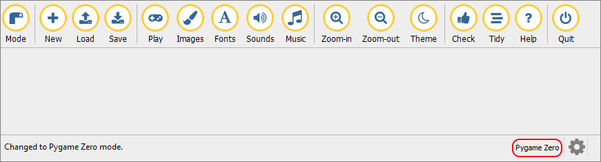
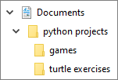
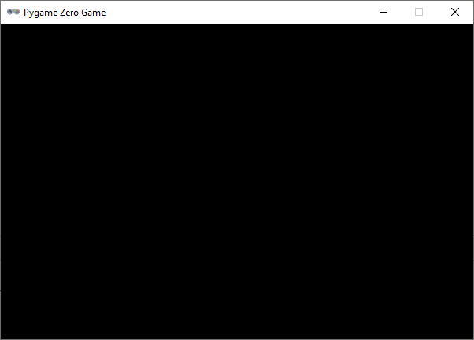
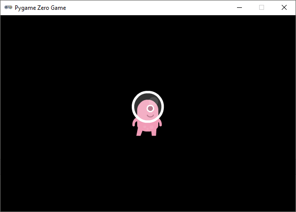

.. role:: python(code)
   :language: python

.. |br| raw:: html
   
    

Pygame Zero
===========

Voor het maken van een game in Mu editor, is het nodig dat je Mu in de Pygame Zero stand zet. Dat gaat als volgt:

1. Klik op de :guilabel:`Mode` knop.
   
   .. image:: images/mu_mode_button.png

2. Selecteer Pygame Zero en klik op Ok.

   .. image:: images/mu_mode.png

Als je dit goed hebt gedaan, staat nu rechtsonder in de statusbalk van Mu editor *Pygame Zero*.

Je ziet tevens dat de knoppenbalk een beetje is veranderd. Bijvoorbeeld in plaats van :guilabel:`Run` vind je nu een :guilabel:`Play` knop.

Mappenstructuur
---------------

Bij het programmeren van een game gebruik je vaak veel bestanden: afbeeldingen, geluiden, lettertypes etcetera. Om te voorkomen dat je na enige tijd door de bomen het bos niet meer ziet, is het belangrijk dat je werkt met een goede mappenstructuur. Die structuur ga je nu maken.

Als je al weet hoe je met de Windows Verkenner nieuwe mappen maakt en hoe je bestanden verplaatst, open dan de korte uitleg hieronder. Als je meer hulp nodig hebt, open dan de uitgebreide uitleg.

.. dropdown:: Mappenstructuur korte uitleg.
   :color: info
   :icon: info

   Maak in je :file:`Documenten` map een map :file:`python projects` aan en daarin weer twee mappen: :file:`turtle exercises` en :file:`games`. Verplaats de eventuele Python bestanden uit de voorgaande lessen die zich nu in je :file:`Documenten` map bevinden naar de map :file:`turtle exercises`.

   .. image:: images/folder_structure_00.png

.. dropdown:: Mappenstructuur uitgebreide uitleg.
   :color: info
   :icon: info

   1. Open een Windows Verkenner en ga daarin naar je :file:`Documenten` map. Waarschijnlijk staan hier verschillende Python bestanden in, die je tijdens de vorige lessen hebt aangemaakt.

      .. image:: images/folder_structure_01.png

   2. Selecteer in het lint bovenin de verkenner het :guilabel:`Start` tabblad (in het Engels :guilabel:`Home`). Je vindt daarin een knop waarmee je een nieuwe map kunt aanmaken. Klik op die knop.

      .. image:: images/folder_structure_02.png

   3. Noem de nieuwe map :file:`python projects`.

      .. image:: images/folder_structure_03.png

   4. Dubbelklik op de zojuist gemaakte map om hem te openen. Je kunt in de adresbalk van de verkenner zien dat je je nu in de map :file:`python projects` bevindt. 

      .. image:: images/folder_structure_04.png

   5. Maak in de map :file:`python projects` twee nieuwe mappen aan met de namen :file:`turtle exercises` en :file:`games`. Je kunt dit op dezelfde manier doen als in stap 2, maar als je avontuurlijk bent, kun je ook de toetscombinatie :kbd:`Ctrl` + :kbd:`Shift` + :kbd:`N` gebruiken om een nieuwe map te maken.

      .. image:: images/folder_structure_05.png

   6. Ga terug naar je :file:`Documenten` map (door in de adresbalk of in het linker navigatiepaneel op :guilabel:`Documenten` te klikken). Klap vervolgens in het navigatiepaneel aan de linkerkant je :file:`Documenten` map uit en ook de map :file:`python projects` die eronder zit. 

      .. image:: images/folder_structure_06.png

   7. Selecteer nu alle Python bestanden door er met de muis 'een rechthoek overheen te slepen'. 

      .. image:: images/folder_structure_07.png

   8. Verplaats de geselecteerde Python bestanden door ze naar de map :file:`turtle exercises` in het navigatiepaneel aan de linkerkant te slepen.

      .. image:: images/folder_structure_08.png

   9. Nu is je :file:`Documenten` map mooi opgeschoond, en je oude turtle oefeningen staan handig bij elkaar in een map.

      .. image:: images/folder_structure_09.png

      De :file:`games` map ga je uiteraard gebruiken om straks je eerste game in op te slaan.

Vensterafmetingen
-----------------

Maak in Mu editor een nieuwe bestand aan met de :guilabel:`New` knop. Voordat je er code in gaat typen, sla je het bestand op in wederom een nieuwe map. Doe dat op de volgende manier:

1. Klik op :guilabel:`Save`. Navigeer naar je nieuwe :file:`games` map en klik daarna op de knop :guilabel:`Nieuwe map` (Engels: :guilabel:`New folder`).

   .. image:: images/save_file_01.png

2. Noem de nieuwe map :file:`alien`.

   .. image:: images/save_file_02.png

3. Dubbelklik op de map :file:`alien` om hem te openen. Sla je bestand vervolgens op onder de naam :file:`alien.py`.

   .. image:: images/save_file_03.png

En nu is het tijd voor de eerste code. Typ het volgende in je bestand. Niet kopiëren en plakken, want het is belangrijk dat je deze code (letterlijk) in de vingers krijgt voor later. Let op het verschil tussen hoofdletters en kleine letters.

.. code-block:: python
   :class: no-copybutton
   :linenos:
   :caption: alien.py
   :name: alien_v01

   # Vensterafmetingen
   WIDTH = 600
   HEIGHT = 400

Klik op :guilabel:`Play` om deze code te runnen. Er verschijnt een venster:

Waarschijnlijk begrijp je al wat de woorden :python:`WIDTH` en :python:`HEIGHT` betekenen. Zo niet, verander dan iets aan de getallen en run de code opnieuw om het effect ervan te zien.

Sprites
-------

Een zwart venster is niet heel interessant. Laten we daar snel wat leven in brengen, door onze hoofdrolspeler te introduceren: een roze alien.

De alien is een afbeelding (Engels: image) die we straks uiteraard gaan laten bewegen. Afbeeldingen van karakters en objecten in games noemen we **sprites**. Voordat we hem kunnen gebruiken, moeten we onze alien sprite downloaden en in de juiste map plaatsen. Volg onderstaande stappen om dat te doen.

1. Klik in Mu editor op de knop :guilabel:`Images`. Door dat te doen creëert Mu editor zelf een map met de naam :file:`images` in je :file:`alien` map. Er wordt automatisch een Windows Verkenner geopend waarin je dat kunt zien.

   .. image:: images/images_folder.png

   Alle sprites die je gebruikt in een game moeten in deze map staan, anders kan Mu editor ze niet vinden.

2. Download de :download:`alien sprite <../game_assets/alien/images/alien.png>`.

   .. image:: ../game_assets/alien/images/alien.png

3. Het gedownloade bestand komt waarschijnlijk terecht in je :file:`Downloads` map. Verplaats het bestand met behulp van de Windows Verkenner naar de :file:`alien\\images` map. Dit kan op verschillende manieren, bijvoorbeeld door het bestand van het ene venster naar het andere te verslepen. Je kunt ook het bestand in de :file:`Downloads` map selecteren, vervolgens :kbd:`Ctrl` + :kbd:`X` gebruiken om het te knippen en :kbd:`Ctrl` + :kbd:`V` in de :file:`alien\\images` map om het te plakken.

   .. image:: images/download_move.png
   
   |br|

   .. dropdown:: Tip
      :color: info
      :icon: info

      In plaats van met de linker muisknop op de downloadlink te klikken, kun je ook de rechter muisknop gebruiken.