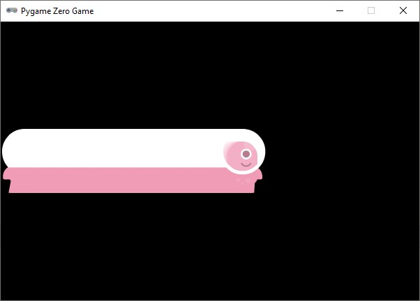
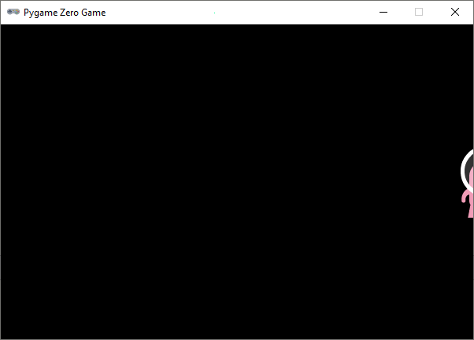

.. role:: python(code)
   :language: python

.. |br| raw:: html

    

Beweging
===========

Tijd voor actie! Die statische alien mag wel eens in beweging komen. Om dat voor elkaar te krijgen, moet je aan je programma een :python:`update()` functie toevoegen. Deze functie wordt door Pygame 60 keer per seconde aangeroepen. Laten we het meteen uitproberen:

.. code-block:: python
   :class: no-copybutton
   :linenos:
   :emphasize-lines: 7, 13-15
   :caption: alien.py
   :name: alien_v11

   # Vensterafmetingen
   WIDTH = 600
   HEIGHT = 400

   # Roze alien Actor
   alien = Actor('alien_pink')
   alien.midleft = (0, HEIGHT / 2)

   # De draw() functie van de game
   def draw():
      alien.draw()

   # De update() functie van de game
   def update():
      alien.left += 2

| In regel 7 positioneren we onze alien aan de linkerkant van het venster, verticaal in het midden. 
| In de :python:`update()` functie zie je op regel 15 :python:`alien.left += 2`. Dit is een kortere schrijfwijze voor :python:`alien.left = alien.left + 2`. Het effect van deze regel is dat de linkerkant van de alien 2 pixels naar rechts opschuift, elke keer wanneer de :python:`update()` functie wordt aangeroepen.

Bij het runnen van de code zie je dat er iets raars gebeurt:

De alien schuift inderdaad naar rechts, maar hij laat een flinke schaduw achter. Er wordt telkens een nieuwe alien over de oude getekend. Door een regel aan je :python:`draw()` functie toe te voegen, los je dit op:

.. code-block:: python
   :class: no-copybutton
   :linenos:
   :emphasize-lines: 11
   :caption: alien.py
   :name: alien_v12

   # Vensterafmetingen
   WIDTH = 600
   HEIGHT = 400

   # Roze alien Actor
   alien = Actor('alien_pink')
   alien.midleft = (0, HEIGHT / 2)

   # De draw() functie van de game
   def draw():
      screen.clear()
      alien.draw()

   # De update() functie van de game
   def update():
      alien.left += 2

Dit ziet er al een stuk beter uit. Maar er is nog wel een probleem: de alien verdwijnt buiten beeld aan de rechterkant van het venster.

Dit gaan we oplossen met een :python:`if` statement. Als de linkerzijde van de alien sprite voorbij de rechterzijde van het venster gaat, verplaatsen we de sprite terug naar links:

.. code-block:: python
   :class: no-copybutton
   :linenos:
   :emphasize-lines: 17-18
   :caption: alien.py
   :name: alien_v13

   # Vensterafmetingen
   WIDTH = 600
   HEIGHT = 400

   # Roze alien Actor
   alien = Actor('alien_pink')
   alien.midleft = (0, HEIGHT / 2)

   # De draw() functie van de game
   def draw():
      screen.clear()
      alien.draw()

   # De update() functie van de game
   def update():
      alien.left += 2
      if alien.left > WIDTH:
         alien.right = 0

Door in regel 18 de rechterzijde van de alien op 0 te zetten, plaatsen we hem net buiten beeld aan de linkerkant van het venster.

.. dropdown:: Opdracht 01
   :color: secondary
   :icon: pencil

   Wijzig je programma zodat de alien aan de rechterkant van het venster begint en naar links beweegt in plaats van naar rechts. Zorg ervoor dat de alien weer op de goede plek verschijnt nadat hij buiten beeld is geraakt.

   .. image:: images/movement_03.png
      :scale: 75%
   
   |br|

   .. dropdown:: Hint
      :color: secondary
      :icon: light-bulb

      Om de alien naar links te laten bewegen hoef je in regel 16 slechts één teken aan te passen. Er moet nu telkens 2 pixels worden afgetrokken in plaats van opgeteld.

   .. dropdown:: Oplossing
      :color: secondary
      :icon: check-circle

      .. code-block:: python
         :class: no-copybutton
         :linenos:
         :caption: alien.py
         :name: alien_v14

         # Vensterafmetingen
         WIDTH = 600
         HEIGHT = 400

         # Roze alien Actor
         alien = Actor('alien_pink')
         alien.midright = (WIDTH, HEIGHT / 2)

         # De draw() functie van de game
         def draw():
            screen.clear()
            alien.draw()

         # De update() functie van de game
         def update():
            alien.left -= 2
            if alien.right < 0:
               alien.left = WIDTH

.. dropdown:: Opdracht 02
   :color: secondary
   :icon: pencil

   Wijzig je programma zodat de alien van boven naar beneden beweegt in plaats van horizontaal. Uiteraard moet hij weer verschijnen nadat hij uit beeld raakt.

   .. image:: images/movement_04.png
      :scale: 75%

.. dropdown:: Opdracht 03
   :color: secondary
   :icon: pencil

   Wijzig je programma zodat de alien van boven naar beneden beweegt, maar niet uit het venster verdwijnt. Zodra zijn voeten de onderkant raken, moet hij stoppen met bewegen.
   Als je opdracht 02 hebt gemaakt, hoef je hiervoor alleen maar regels 17 en 18 aan te passen.

   .. image:: images/movement_05.png
      :scale: 75%

   |br|

   .. dropdown:: Oplossing
      :color: secondary
      :icon: check-circle

      .. code-block:: python
         :class: no-copybutton
         :linenos:
         :emphasize-lines: 19
         :caption: alien.py
         :name: alien_v15

         # Vensterafmetingen
         WIDTH = 600
         HEIGHT = 400

         # Roze alien Actor
         alien = Actor('alien_pink')
         alien.midtop = (WIDTH / 2, 0)

         # De draw() functie van de game
         def draw():
            screen.clear()
            alien.draw()

         # De update() functie van de game
         def update():
            alien.y += 2
            if alien.bottom > HEIGHT:
               alien.bottom = HEIGHT

Snelheid
--------

In regel 16 van :file:`alien.py` verandert de positie van de alien 2 pixels door de instructie :python:`alien.left += 2` (of varianten daarvan). Om de alien sneller te laten bewegen, kun je een groter getal dan 2 nemen. Bijvoorbeeld :python:`alien.left += 5`. Maar het is nog mooier om, in plaats van de verplaatsing te *hardcoden* met een getal in deze regel, een variabele te gebruiken voor de snelheid. We gaan hiervoor even terug naar de versie waarin de alien van links naar rechts beweegt:

.. code-block:: python
   :linenos:
   :emphasize-lines: 8, 17
   :caption: alien.py
   :name: alien_v16

   # Vensterafmetingen
   WIDTH = 600
   HEIGHT = 400

   # Roze alien Actor
   alien = Actor('alien_pink')
   alien.midleft = (0, HEIGHT / 2)
   alien.speed = 10

   # De draw() functie van de game
   def draw():
      screen.clear()
      alien.draw()

   # De update() functie van de game
   def update():
      alien.left += alien.speed
      if alien.left > WIDTH:
         alien.right = 0

Je ziet dat regel 17 is gewijzigd naar :python:`alien.left += alien.speed` (speed is het Engelse woord voor snelheid) en dat in regel 8 de variabele :python:`alien.speed` de waarde 10 heeft gekregen. Om de snelheid van de alien te veranderen hoef je slechts het getal in regel 8 te wijzigen.

.. dropdown:: Opdracht 04
   :color: secondary
   :icon: pencil

   Test verschillende snelheden door het getal in regel 8 te wijzigen. Probeer ook eens een negatief getal in te vullen, bijvoorbeeld :python:`alien.speed = -4` en bekijk wat het gevolg is. 

Nu we voor de snelheid een variabele gebruiken, kun je tijdens de uitvoering van het programma de snelheid nog veranderen. Voeg maar eens de volgende regel toe aan de :python:`update()` functie:

.. code-block:: python
   :class: no-copybutton
   :linenos:
   :lineno-start: 15
   :emphasize-lines: 4
   :caption: alien.py
   :name: alien_v17

   # De update() functie van de game
   def update():
      alien.left += alien.speed
      alien.speed += 0.1
      if alien.left > WIDTH:
         alien.right = 0

Je kunt je alien ook steeds langzamer laten bewegen:

.. code-block:: python
   :class: no-copybutton
   :linenos:
   :lineno-start: 15
   :emphasize-lines: 4
   :caption: alien.py
   :name: alien_v18

   # De update() functie van de game
   def update():
      alien.left += alien.speed
      alien.speed -= 0.1
      if alien.left > WIDTH:
         alien.right = 0

Maar dan zie je dat hij al snel de andere kant op gaat omdat de snelheid een negatief getal wordt. Als je dat niet wilt, zou je het zo kunnen doen:

.. code-block:: python
   :class: no-copybutton
   :linenos:
   :lineno-start: 15
   :emphasize-lines: 4
   :caption: alien.py
   :name: alien_v19

   # De update() functie van de game
   def update():
      alien.left += alien.speed
      alien.speed *= 0.99
      if alien.left > WIDTH:
         alien.right = 0

De uitdrukking :python:`alien.speed *= 0.99` betekent :python:`alien.speed = alien.speed * 0.99`. Daarmee zeg je dat de nieuwe snelheid telkens 99% van de oude snelheid moet zijn, waardoor de snelheid afneemt, maar nooit negatief wordt.

.. dropdown:: Opdracht 05
   :color: secondary
   :icon: pencil

   Verwijder regel 18 uit je code, zodat de snelheid weer constant blijft. Wijzig daarna je programma zodat de alien van links naar rechts beweegt, maar zodra hij de rechterkant van het venster raakt moet hij omkeren en met dezelfde snelheid weer naar links gaan.

   .. dropdown:: Hint
      :color: secondary
      :icon: light-bulb

      Zodra de rechterkant van de alien de vensterrand raakt, moet hij omkeren. Dus het :python:`if` statement in regel 18 moet worden aangepast. En wat moet er op regel 19 op de puntjes komen te staan?

      .. code-block:: python
         :class: no-copybutton
         :linenos:
         :lineno-start: 15
         :emphasize-lines: 4-5
         :caption: alien.py
         :name: alien_v20

         # De update() functie van de game
         def update():
            alien.left += alien.speed
            if alien.right >= WIDTH:
               alien.speed = ...

   .. dropdown:: Oplossing
      :color: secondary
      :icon: check-circle

      Zodra de rechterkant van de alien de vensterrand raakt, moet de alien met dezelfde snelheid de andere kant op gaan. Dat doe je door de snelheid negatief te maken. Als de snelheid eerst 10 was, moet hij -10 worden. In de onderstaande code gebeurt dat op regel 19.

      .. code-block:: python
         :class: no-copybutton
         :linenos:
         :lineno-start: 15
         :emphasize-lines: 4-5
         :caption: alien.py
         :name: alien_v21

         # De update() functie van de game
         def update():
            alien.left += alien.speed
            if alien.right >= WIDTH:
               alien.speed = -alien.speed

.. dropdown:: Opdracht 06
   :color: secondary
   :icon: pencil

   Als je opdracht 04 hebt gemaakt, is deze opdracht een koud kunstje. In opdracht 04 verdween de alien na het omkeren aan de linkerkant uit het scherm. Zorg ervoor dat dat niet gebeurt: de alien moet heen en weer bewegen in het venster.

   .. dropdown:: Hint
      :color: secondary
      :icon: light-bulb

      Je hoeft alleen regel 18 te wijzigen. Die regel moet gaan zeggen: 'Als de rechterkant van de alien voorbij de rechterkant van het venster komt OF als de linkerkant van de alien voorbij de linkerkant van het venster komt dan...'. Je hebt dus het :python:`or` keyword nodig. 

   .. dropdown:: Oplossing
      :color: secondary
      :icon: check-circle

      .. code-block:: python
         :class: no-copybutton
         :linenos:
         :lineno-start: 15
         :emphasize-lines: 4
         :caption: alien.py
         :name: alien_v22

         # De update() functie van de game
         def update():
            alien.left += alien.speed
            if alien.right >= WIDTH or alien.left <= 0:
               alien.speed = -alien.speed

      Als de snelheid negatief was, zorgt de regel :python:`alien.speed = -alien.speed` ervoor dat hij weer positief wordt, want 'min min is plus'.