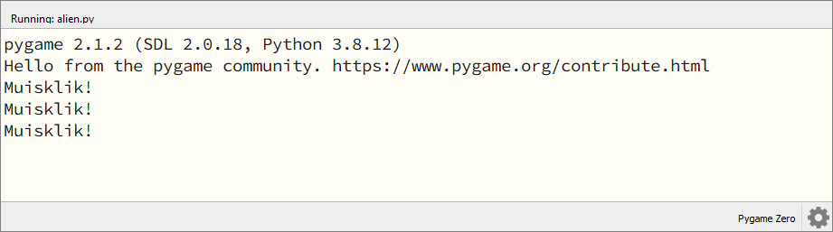
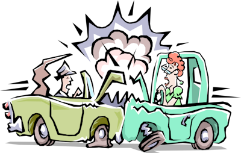
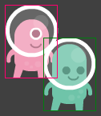
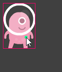

.. role:: python(code)
   :language: python

.. |br| raw:: html

    

Events
===========

De meeste computerprogramma's, en games in het bijzonder, reageren op handelingen van de gebruiker, bijvoorbeeld wanneer de gebruiker de muis beweegt of een toets op het toetsenbord indrukt. Een gebeurtenis waarop een computerprogramma kan reageren noemen we een *event*. Voorbeelden van events zijn:

* de gebruiker klikt met de linker muisknop;
* de gebruiker hovert (zweeft) met de muis ergens overheen;
* de gebruiker drukt op de spatiebalk.

Je kunt je programma op events laten reageren door speciale functies te definiëren, zogenoemde *event handler* functies. De namen van dit soort functies beginnen altijd met het Engelse woord 'on'. Voorbeelden van de in Pygame Zero beschikbare event handler functies zijn:

* :python:`on_mouse_down()`
* :python:`on_mouse_move()`
* :python:`on_key_down()`

We starten in dit hoofdstuk met de code die onze alien van links naar rechts door het venster laat bewegen:

.. code-block:: python
   :linenos:
   :caption: alien.py
   :name: alien_v23

   # Vensterafmetingen
   WIDTH = 600
   HEIGHT = 400

   # Roze alien Actor
   alien = Actor('alien_pink')
   alien.midleft = (0, HEIGHT / 2)
   alien.speed = 10

   # De draw() functie van de game
   def draw():
      screen.clear()
      alien.draw()

   # De update() functie van de game
   def update():
      alien.left += alien.speed
      if alien.left >= WIDTH:
         alien.right = 0

Muisklikken
-----------

Om het programma op een muisklik te laten reageren, voeg je de :python:`on_mouse_down()` event handler toe:

.. code-block:: python
   :class: no-copybutton
   :linenos:
   :emphasize-lines: 21-23
   :caption: alien.py
   :name: alien_v24

   # Vensterafmetingen
   WIDTH = 600
   HEIGHT = 400

   # Roze alien Actor
   alien = Actor('alien_pink')
   alien.midleft = (0, HEIGHT / 2)
   alien.speed = 10

   # De draw() functie van de game
   def draw():
      screen.clear()
      alien.draw()

   # De update() functie van de game
   def update():
      alien.left += alien.speed
      if alien.left >= WIDTH:
         alien.right = 0

   # Mouse down event handler
   def on_mouse_down():
      print("Muisklik!")

Run deze code. Klik enkele keren met de muis in het game venster en zie dat onderin het Mu editor venster bij elke klik de tekst *Muisklik!* wordt afgedrukt.

We kunnen in de :python:`on_mouse_down()` functie een variabele met de naam :python:`pos` gebruiken om de positie van de muis te achterhalen. Pas de functie als volgt aan en bekijk het resultaat:

.. code-block:: python
   :class: no-copybutton
   :linenos:
   :lineno-start: 21
   :emphasize-lines: 2-3
   :caption: alien.py
   :name: alien_v25

   # Mouse down event handler
   def on_mouse_down(pos):
      print("Muisklik op positie", pos)

Ook is het mogelijk te detecteren met welke muisknop is geklikt. Probeer het volgende maar eens:

.. code-block:: python
   :class: no-copybutton
   :linenos:
   :lineno-start: 21
   :emphasize-lines: 2-3
   :caption: alien.py
   :name: alien_v26

   # Mouse down event handler
   def on_mouse_down(button, pos):
      print("Muisklik met", button, "op positie", pos)

Met de positie van de muisklik is het mogelijk om te checken of de gebruiker óp of náást onze roze alien heeft geklikt. Daarvoor hebben we *collision detection* nodig.

Collision detection
-------------------

Het Engelse woord collision betekent botsing. Collision detection is een belangrijke techniek bij het programmeren van games, die we gebruiken om vast te stellen of twee objecten elkaar raken of zelfs overlappen. Wanneer je bijvoorbeeld een schietspel programmeert is het handig om te signaleren wanneer een granaat sprite de vijand sprite raakt, want waarschijnlijk moet er dan iets gebeuren (de vijand ontploft, er wordt een punt bij de score opgeteld, etcetera).

Actors in Pygame Zero beschikken over verschillende functies voor collision detection. Met bijvoorbeeld de functie :python:`colliderect()` kun je checken of de twee rechthoeken die twee sprites innemen elkaar overlappen. 

Voor onze muisklik event handler hebben we een andere functie nodig, namelijk een die checkt of een punt zich binnen de rechthoek van een sprite bevindt. Want wij willen weten of het punt van de muisklik zich binnen het gebied van de alien sprite bevindt.

De functie die wij nodig hebben is :python:`collidepoint()`. Deze gebruiken we in het volgende :python:`if` statement:

.. code-block:: python
   :class: no-copybutton
   :linenos:
   :lineno-start: 21
   :emphasize-lines: 3-6
   :caption: alien.py
   :name: alien_v27

   # Mouse down event handler
   def on_mouse_down(button, pos):
      if alien.collidepoint(pos):
         print("Au!")
      else:
         print("Mis!")

De regels 23 tot en met 26 kun je vertalen als: "Als de muispositie :python:`pos` zich binnen de rechthoek van :python:`alien` bevindt, druk dan :python:`"Au!"` af en druk anders :python:`"Mis!"` af." Test de werking van deze code. Gaat de alien te snel om hem te kunnen raken, verlaag dan de snelheid in regel 8 van je code.

Met het printen van :python:`"Au!"` en :python:`"Mis!"` kun je snel testen of de collision detection goed werkt, maar het is natuurlijk leuker als een muisklik gevolgen heeft voor de alien. Je zou hem bijvoorbeeld met elke klik sneller kunnen laten bewegen:

.. code-block:: python
   :class: no-copybutton
   :linenos:
   :lineno-start: 21
   :emphasize-lines: 4
   :caption: alien.py
   :name: alien_v28

   # Mouse down event handler
   def on_mouse_down(button, pos):
      if alien.collidepoint(pos):
         alien.speed += 1

Zet voordat je deze code uitvoert de startsnelheid in regel 8 op 1:

.. code-block:: python
   :class: no-copybutton
   :linenos:
   :lineno-start: 8
   :caption: alien.py
   :name: alien_v29

   alien.speed = 1

.. dropdown:: Extra: snelheid in het venster tonen
   :color: info
   :icon: info

   Misschien vind je het leuk om de snelheid van de alien in het venster te zien. Dit kun je doen door aan je :python:`draw()` functie de volgende regel toe te voegen:

   .. code-block:: python
      :class: no-copybutton
      :linenos:
      :lineno-start: 10
      :emphasize-lines: 4
      :caption: alien.py
      :name: alien_v30

      # De draw() functie van de game
      def draw():
         screen.clear()
         screen.draw.text(f"Snelheid: {alien.speed}.", (10, 10), color="orange")
         alien.draw()

   In regel 13 gebruiken we de functie :python:`screen.draw.text(text, pos, color)` om een tekst op een bepaalde positie in een bepaalde kleur op het scherm te tonen. Het :python:`text` argument ziet er een beetje ingewikkeld uit:
   
      :python:`f"Snelheid: {alien.speed}."`
   
   De letter f geeft aan dat    