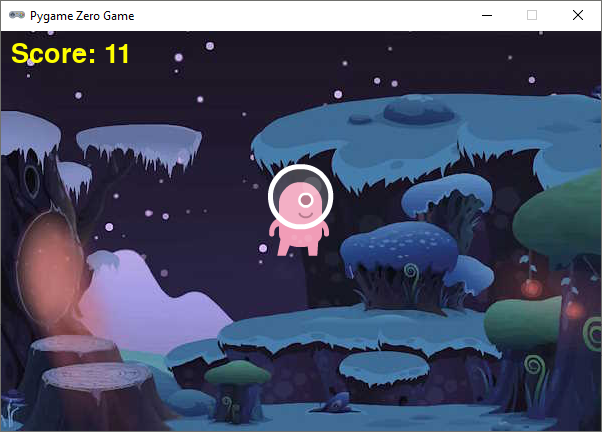

.. role:: python(code)
   :language: python

.. |br| raw:: html

    

Winnen en verliezen
====================

Bij veel games gaat het om winnen of verliezen. Als je wint, heb je een goede score en als je verliest is het 'game over'. In dit hoofdstuk maken we een spel waarin je aliens zo lang mogelijk in de lucht moet houden. Zodra een alien de grond raakt, is het spel afgelopen.

Het uitgangspunt voor het spel is de onderstaande code.

.. code-block:: python
   :linenos:
   :caption: alien.py
   :name: alien_final_game_v00

   # Vensterafmetingen
   WIDTH = 600
   HEIGHT = 400

   # Roze alien Actor
   alien = Actor('alien_pink')
   alien.midbottom = (WIDTH / 2, 0)
   alien.speed = 3
   alien.jump_distance = 150

   # De draw() functie van de game
   def draw():
      screen.clear()
      alien.draw()

   # De update() functie van de game
   def update():
      alien.y += alien.speed
      if alien.bottom > HEIGHT:
         alien.bottom = HEIGHT
   
   # Mouse down event handler
   def on_mouse_down(button, pos):
      if alien.collidepoint(pos):
         alien.y -= alien.jump_distance

Bij aanvang van de game bevindt de alien zich net boven de bovenrand van het venster. Hij valt met 3 pixels per frame naar beneden en wanneer de gebruiker met de muis op hem klikt, springt hij 150 pixels omhoog.

Game over
---------

Het spel is afgelopen zodra de alien de onderkant van het venster raakt. Het spel moet stoppen en de boodschap 'game over' verschijnt. Voor deze boodschap gebruiken we een sprite. Download de :download:`game_over sprite <../game_assets/alien/images/game_over.png>` naar je :file:`alien\\images` map.

|br|

Voeg voor de 'game over' boodschap een nieuwe Actor :python:`game_over_message` toe, onder de :python:`alien` Actor:

.. code-block:: python
   :class: no-copybutton
   :linenos:
   :lineno-start: 5
   :emphasize-lines: 7-9
   :caption: alien.py
   :name: alien_final_game_v01

   # Roze alien Actor
   alien = Actor('alien_pink')
   alien.midbottom = (WIDTH / 2, 0)
   alien.speed = 3
   alien.jump_distance = 150

   # Game over message
   game_over_message = Actor('game_over')
   game_over_message.center = (WIDTH / 2, HEIGHT / 2)

Om de boodschap te tonen moeten we in de :python:`draw()` functie :python:`game_over_message.draw()` aanroepen. Wat gaat er mis als we dat doen op de onderstaande manier? Probeer het uit.

.. code-block:: python
   :class: no-copybutton
   :linenos:
   :lineno-start: 15
   :emphasize-lines: 5
   :caption: alien.py

   # De draw() functie van de game
   def draw():
      screen.clear()
      alien.draw()
      game_over_message.draw()

Nu wordt 'game over' al vanaf het begin op het scherm getoond! Om ervoor te zorgen dat de sprite alleen zichtbaar is als het spel daadwerkelijk voorbij is, hebben we een variabele nodig:

.. code-block:: python
   :class: no-copybutton
   :linenos:
   :lineno-start: 11
   :emphasize-lines: 5-6
   :caption: alien.py

   # Game over message
   game_over_message = Actor('game_over')
   game_over_message.center = (WIDTH / 2, HEIGHT / 2)

   # Variables
   game_over = False

Je kunt in variabelen getallen opslaan maar ook de waarden :python:`True` en :python:`False` om aan te geven dat iets *waar* of *niet waar* is. De variabele :python:`game_over` stelt ons in staat om in de :python:`draw()` functie een :python:`if` statement te maken:

.. code-block:: python
   :class: no-copybutton
   :linenos:
   :lineno-start: 18
   :emphasize-lines: 5-6
   :caption: alien.py

   # De draw() functie van de game
   def draw():
      screen.clear()
      alien.draw()
      if game_over:
         game_over_message.draw()

Het probleem is opgelost. De :python:`game_over_message` sprite is niet meer zichtbaar vanaf het begin. Echter, hij moet wél zichtbaar worden wanneer de alien de grond raakt. In welke functie detecteren we die gebeurtenis? Juist, in de :python:`update()` functie. In het :python:`if` statement dat het raken van de grond afhandelt, zetten we :python:`game_over` op :python:`True`:

.. code-block:: python
   :class: no-copybutton
   :linenos:
   :lineno-start: 25
   :emphasize-lines: 6
   :caption: alien.py

   # De update() functie van de game
   def update():
      alien.y += alien.speed
      if alien.bottom > HEIGHT:
         alien.bottom = HEIGHT
         game_over = True

Nu zou het moeten werken, toch? Probeer maar eens.

De 'game over' boodschap verschijnt niet. Er gebeurt helemaal niets. De oorzaak hiervan is een beetje ingewikkeld. Hou je wel van ingewikkelde dingen, klap dan de onderstaande uitleg over globale variabelen open.

.. dropdown:: Meer weten over globale variabelen?
   :color: info
   :icon: info

   In Python creëer je een variabele met een assignment statement:

   .. card:: Assignment statement

      :python:`<variabelenaam> = <waarde>`

   Het maakt echter uit op welke plek dat assignment statement staat. Bekijk de volgende code. Als je het zelf wilt testen, maak dan een nieuw bestand in Mu editor en stel de mode van Mu editor in op Python 3.

   .. code-block:: python
      :linenos:
      :emphasize-lines: 1, 5

      g = 1                # Globale variabele

      # Functie spam()
      def spam():
         l = 2             # Lokale variabele
         print(l)

      # Hoofdprogramma
      print(g)
      spam()

   | Op regel 1 wordt de variabele :python:`g` gemaakt. Dit is een globale variabele, **want deze regel bevindt zich niet in een functie**. 
   | Op regel 5 wordt de variabele :python:`l` gemaakt. Dit is een lokale variabele, **want deze regel bevindt zich wél in een functie**.

   Globale variabelen zijn in je hele programma bekend, ook in de functies. Lokale variabelen echter zijn enkel bekend binnen de functie waarin ze zijn gemaakt. Buiten die functie bestaan ze niet.

   Het volgende kan dus:

   .. code-block:: python
      :linenos:
      :emphasize-lines: 7

      g = 1                # Globale variabele

      # Functie spam()
      def spam():
         l = 2             # Lokale variabele
         print(l)
         print(g)          # Globale variabele g is hier bekend

      # Hoofdprogramma
      print(g)
      spam()

   Maar het volgende levert een foutmelding op:

   .. code-block:: python
      :linenos:
      :emphasize-lines: 11

      g = 1                # Globale variabele

      # Functie spam()
      def spam():
         l = 2             # Lokale variabele
         print(l)

      # Hoofdprogramma
      print(g)
      spam()
      print(l)             # Lokale variabele l is hier niet bekend

   De oplettende lezer zal nu zeggen: 'Dan is er toch geen probleem? Onze :python:`game_over` variabele in :file:`alien.py` is globaal, dus bekend in de :python:`update()` functie.' Dat is waar, maar er zit nog een addertje (een Python?) onder het gras: van globale variabelen kun je binnen een functie wel de waarde opvragen, maar je kunt er niet een nieuwe waarde in opslaan. Ons assignment statement in regel 31 wordt door Python geïnterpreteerd als het aanmaken van een nieuwe variabele :python:`game_over`. We hebben dan dus twee variabelen met dezelfde naam, een globale en een lokale.

   .. code-block:: python

      # Variables
      game_over = False          # Globale variabele game_over

      ...

      # De update() functie van de game
      def update():
         ...
            game_over = True     # Lokale variabele game_over

   Om een globale variabele binnen een functie te kunnen wijzigen, moet je bovenaan die functie het keyword :python:`global` gebruiken, gevolgd door de naam van de variabele. Dus:

   .. code-block:: python
      :emphasize-lines: 8

      # Variables
      game_over = False          # Globale variabele game_over

      ...

      # De update() functie van de game
      def update():
         global game_over
         ...
            game_over = True     # Globale variabele game_over

   .. dropdown:: Waarschuwing
      :open:
      :color: warning
      :icon: alert
      
      Het gebruik van globale variabelen is eigenlijk 'bad practice'; je kunt ze beter zo min mogelijk gebruiken, zeker wanneer je grotere programmeerprojecten gaat doen. Voor ons kleine alien spelletje is het echter geen probleem.

Als je even geen trek hebt in ingewikkelde dingen, maar wel graag je game werkend wil maken, voeg dan bovenaan de :python:`update()` functie de volgende regel toe:

.. code-block:: python
   :class: no-copybutton
   :linenos:
   :lineno-start: 25
   :emphasize-lines: 3
   :caption: alien.py

   # De update() functie van de game
   def update():
      global game_over
      alien.y += alien.speed
      if alien.bottom > HEIGHT:
         alien.bottom = HEIGHT
         game_over = True

Misschien heb je het al gemerkt: na het verschijnen van de 'game over' boodschap kun je nog steeds op de alien klikken om hem te laten springen. Om dat op te lossen, voegen we een extra if-statement toe aan de :python:`on_mouse_down()` event handler:

.. code-block:: python
   :class: no-copybutton
   :linenos:
   :lineno-start: 33
   :emphasize-lines: 3-4
   :caption: alien.py

   # Mouse down event handler
   def on_mouse_down(button, pos):
      if game_over:
         return
      if alien.collidepoint(pos):
         alien.y -= alien.jump_distance

Het keyword :python:`return` zorgt ervoor dat Python direct terugkeert uit de functie, zonder de rest van de code uit te voeren.

Score
------

In ons alien spel is je score eigenlijk de tijd; hoe langer je de alien in de lucht houdt, hoe hoger je score. Daarvoor hebben we de Pygame Zero :python:`clock` nodig. Maar laten we beginnen met het maken van een :python:`score` variabele:

.. code-block:: python
   :class: no-copybutton
   :linenos:
   :lineno-start: 15
   :emphasize-lines: 3
   :caption: alien.py

   # Variables
   game_over = False
   score = 0

Om de score elke seconde met een punt te verhogen, moeten we een nieuwe functie maken. Definieer de functie :python:`increment_score()` als volgt:

.. code-block:: python
   :class: no-copybutton
   :linenos:
   :lineno-start: 15
   :emphasize-lines: 5-9
   :caption: alien.py

   # Variables
   game_over = False
   score = 0

   # Functie increment_score() verhoogt de score
   def increment_score():
      global score
      score += 1

Ook hier moet je weer het keyword :python:`global` gebruiken om de waarde van de globale variabele :python:`score` te kunnen wijzigen binnen de functie.

Het tonen van de score gebeurt in de :python:`draw()` functie:

.. code-block:: python
   :class: no-copybutton
   :linenos:
   :lineno-start: 24
   :emphasize-lines: 5
   :caption: alien.py

   # De draw() functie van de game
   def draw():
      screen.clear()
      alien.draw()
      screen.draw.text(f"Score: {score}", (10, 10), color = "yellow", fontsize = 40)
      if game_over:
         game_over_message.draw()

We zijn er bijna. We moeten er alleen nog voor zorgen dat de functie :python:`increment_score` elke seconde wordt aangeroepen. Daarvoor gebruiken we de functie :python:`clock.schedule_interval()`. Deze hoeft slechts één keer te worden aangeroepen, helemaal aan het begin van de game. Daarom plaatsen we de aanroep helemaal onderaan in het 'hoofdprogramma':

.. code-block:: python
   :class: no-copybutton
   :linenos:
   :lineno-start: 40
   :emphasize-lines: 8-9
   :caption: alien.py

   # Mouse down event handler
   def on_mouse_down(button, pos):
      if game_over:
         return
      if alien.collidepoint(pos):
         alien.y -= alien.jump_distance
         
   # Hoofdprogramma
   clock.schedule_interval(increment_score, 1)

Tussen de haakjes van :python:`clock.schedule_interval()` staat eerst de naam van de functie die we telkens willen aanroepen gevolgd door het tijdsinterval in seconden. Regel 48 zorgt er dus voor dat :python:`increment_score` elke :python:`1` seconde wordt aangeroepen.

Onze game is nu al redelijk speelbaar, maar er gaat nog iets niet helemaal goed. Kun je ontdekken wat dat is?

Je kunt het probleem op de volgende manier oplossen:

.. code-block:: python
   :class: no-copybutton
   :linenos:
   :lineno-start: 32
   :emphasize-lines: 8
   :caption: alien.py

   # De update() functie van de game
   def update():
      global game_over
      alien.y += alien.speed
      if alien.bottom > HEIGHT:
         alien.bottom = HEIGHT
         game_over = True
         clock.unschedule(increment_score)

Na het verschijnen van 'game over', werd de score nog steeds elke seconde opgehoogd. Door het aanroepen van :python:`clock.unschedule(increment_score)` is dat gestopt.

Achtergrond(muziek)
-------------------

Ons spel kan nog wel wat verfraaiing gebruiken. We gaan een achtergrondafbeelding toevoegen en ook een achtergrondmuziekje. Download de :download:`achtergrondafbeelding <../game_assets/alien/images/background.jpg>` naar je :file:`alien\\images` map.

|br|

Om de achtergrondafbeelding zichtbaar te maken, vervang je de aanroep :python:`screen.clear()` in regel 26 door :python:`screen.blit('background', (0, 0))`. 

.. code-block:: python
   :class: no-copybutton
   :linenos:
   :lineno-start: 24
   :emphasize-lines: 3
   :caption: alien.py

   # De draw() functie van de game
   def draw():
      screen.blit('background', (0, 0))
      alien.draw()
      screen.draw.text(f"Score: {score}", (10, 10), color = "yellow", fontsize = 40)
      if game_over:
         game_over_message.draw()

Bekijk het resultaat. Dat ziet er meteen een stuk beter uit toch? Omdat een achtergrond statisch is (niet hoeft te bewegen), hebben we er geen :python:`Actor` voor aangemaakt, zoals we dat met de alien en de 'game over' boodschap deden. De aanroep :python:`screen.clear()` is overbodig geworden omdat de achtergrond telkens opnieuw wordt getekend wanneer de alien zich verplaatst. 

Klik in Mu editor op de :guilabel:`Music` knop om de map :file:`alien\\music` aan te maken en te openen. Download vervolgens de :download:`achtergrondmuziek <../game_assets/alien/music/astro_race.mp3>` naar die map. Overigens is deze muziek afkomstig van `Zapsplat <https://www.zapsplat.com/sound-effect-category/game-music-and-loops/>`_, een website waar je muziek zonder copyrights kunt downloaden. Ook vind je hier een grote verzameling geluidseffecten voor je games.

Om de muziek te laten afspelen hoef je slechts één regel aan het hoofdprogramma toe te voegen:

.. code-block:: python
   :class: no-copybutton
   :linenos:
   :lineno-start: 48
   :emphasize-lines: 3
   :caption: alien.py

   # Hoofdprogramma
   clock.schedule_interval(increment_score, 1)
   music.play('astro_race')

De basis van het spel is nu klaar. Ben je ergens halverwege de draad kwijtgeraakt, dan kun je hieronder de volledige code bekijken. Natuurlijk zijn nog allerhande verbeteringen mogelijk. In het volgende hoofdstuk bekijken we enkele van die verbetermogelijkheden.

.. dropdown:: Volledige code van het spel
   :color: info
   :icon: info

   .. code-block:: python
      :linenos:
      :caption: alien.py

      # Vensterafmetingen
      WIDTH = 600
      HEIGHT = 400

      # Roze alien Actor
      alien = Actor('alien_pink')
      alien.midbottom = (WIDTH / 2, 0)
      alien.speed = 3
      alien.jump_distance = 150

      # Game over message
      game_over_message = Actor('game_over')
      game_over_message.center = (WIDTH / 2, HEIGHT / 2)

      # Variables
      game_over = False
      score = 0

      # Functie increment_score() verhoogt de score
      def increment_score():
         global score
         score += 1

      # De draw() functie van de game
      def draw():
         screen.blit('background', (0, 0))
         alien.draw()
         screen.draw.text(f"Score: {score}", (10, 10), color = "yellow", fontsize = 40)
         if game_over:
            game_over_message.draw()

      # De update() functie van de game
      def update():
         global game_over
         alien.y += alien.speed
         if alien.bottom > HEIGHT:
            alien.bottom = HEIGHT
            game_over = True
            clock.unschedule(increment_score)
      
      # Mouse down event handler
      def on_mouse_down(button, pos):
         if game_over:
            return
         if alien.collidepoint(pos):
            alien.y -= alien.jump_distance
            
      # Hoofdprogramma
      clock.schedule_interval(increment_score, 1)
      music.play('astro_race')      