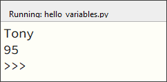

.. role:: python(code)
   :language: python

Code herhalen met loops
=======================

.. ToDo: nog wat inleiding schrijven (in het vorige onderdeel veel herhalende code getypt)

Variabelen
----------

.. grid:: 2
    :padding: 0

    .. grid-item::
        :columns: 6

        Voordat je je in loops gaat verdiepen, is het nodig dat je iets weet van *variabelen*. Een variabele is een plaats in het geheugen van de computer waarin je een waarde kunt opslaan. Je kunt een variabele vergelijken met een lade in een ladenkast. De lade heeft een label dat aangeeft wat er in zit en in de lade zit inhoud. Een variabele heeft een naam die (meestal) aangeeft wat er in zit en in de variabele zit een waarde.

    .. grid-item::
        :columns: 6

        .. image:: images/variables.png
          
Maak in Mu editor weer een nieuw bestand door op de knop :guilabel:`New` te klikken. Typ de onderstaande code in het bestand (dus niet kopiëren en plakken) en let daarbij op hoofd- en kleine letters en ook op spaties. Sla het bestand op als :file:`hello_variables.py`.

.. code-block:: python
    :class: no-copybutton
    :linenos:
    :caption: hello_variables.py
    :name: hello_variables_v01

    naam_tony = 'Tony'
    leeftijd_tony = 95
    print(naam_tony)
    print(leeftijd_tony)
          
In deze code wordt op regel 1 een variabele :python:`naam_tony` gemaakt, waarin de waarde :python:`'Tony'` wordt opgeslagen. Op regel 2 krijgt de variabele :python:`leeftijd_tony` de waarde :python:`95` (schildpadden kunnen heel oud worden). De functie :python:`print()` op regels 3 en 4 toont de waarden van :python:`naam_tony` en :python:`leeftijd_tony` op het scherm.

Het aardige van variabelen is dat je ermee kunt rekenen. Breid je code als volgt uit:

.. code-block:: python
    :class: no-copybutton
    :linenos:
    :emphasize-lines: 2,4,7,8
    :caption: hello_variables.py
    :name: hello_variables_v02

    naam_tony = 'Tony'
    naam_tina = 'Tina'
    leeftijd_tony = 95
    leeftijd_tina = leeftijd_tony - 5
    print(naam_tony)
    print(leeftijd_tony)
    print(naam_tina)
    print(leeftijd_tina)

While loops
-----------

Maak in Mu editor weer een nieuw bestand door op de knop :guilabel:`New` te klikken. Kopieer en plak de onderstaande code in het bestand en sla het op als :file:`turtle_while.py`.

.. code-block:: python
    :linenos:
    :caption: turtle_while.py
    :name: turtle_while

    import turtle

    tony = turtle.Turtle()

    zijde = 0
    while zijde < 4:
        tony.forward(100)
        tony.lt(90)
        zijde = zijde + 1

Run de code om het resultaat te bekijken.

Sommige functies zoals :python:`print()` zitten standaard in Python, maar om met de schildpad te kunnen werken is het nodig de module :python:`turtle` te importeren. Dat gebeurt op regel 1. Op regel 3 maken we met de functie :python:`Turtle()` uit de :python:`turtle` module een schildpad aan met de naam :python:`tony`. Op regel 5 sturen we :python:`tony` 100 pixels naar voren.

.. image:: images/turtle_01.png
    :scale: 50%

Maar wat is dat nu? Onze Tony lijkt helemaal niet op een schildpad! Hij lijkt meer op een pijlpunt! Daar gaan we verandering in brengen. En we gaan hem ook van richting laten veranderen. Pas je code als volgt aan (de nieuwe regels zijn gemarkeerd):

.. code-block:: python
    :class: no-copybutton
    :linenos:
    :caption: hello_turtle.py
    :name: hello_turtle_v02
    :emphasize-lines: 4,7-12

    import turtle

    tony = turtle.Turtle()
    tony.shape('turtle')

    tony.forward(100)
    tony.left(90)
    tony.forward(50)
    tony.left(90)
    tony.forward(100)
    tony.left(90)
    tony.forward(50)

Op regel 4 zorgt :python:`tony.shape('turtle')` ervoor dat onze schildpad er ook uitziet als een schildpad. De regels 7, 9 en 11 laten :python:`tony` linksaf slaan alvorens verder te lopen.

.. dropdown:: Meer weten over turtle shapes?
    :color: info
    :icon: info

    Om de vorm van :python:`tony` in een schildpad te veranderen, gaven we de functie :python:`tony.shape()` de waarde :python:`'turtle'` mee. Er zijn echter nog andere vormen mogelijk. Dit is de volledige lijst:

    * :python:`'arrow'`
    * :python:`'turtle'`
    * :python:`'circle'`
    * :python:`'square'`
    * :python:`'triangle'`
    * :python:`'classic'`
 
De waarde die je tussen de haakjes aan de functie :python:`tony.forward()` meegeeft, is het aantal pixels dat de schildpad vooruit moet bewegen. Maar wat doet het getal :python:`90` tussen de haakjes van :python:`tony.left()`?

.. dropdown:: Vraag 01
    :color: secondary
    :icon: question

    Wat betekent het getal :python:`90` tussen de haakjes van :python:`turtle.left()`?

    .. dropdown:: Antwoord
        :color: secondary
        :icon: check-circle

        Dat getal geeft aan hoeveel **graden** de turtle moet draaien. Een hoek van 90° is een rechte hoek. De aanroep :python:`turtle.left(90)` zorgt er dus voor dat de turtle 90° naar links draait, oftewel linksaf slaat.

        In onderstaande figuur zie je hoe een cirkel in graden is verdeeld. Hoeveel graden zitten er in een volledige cirkel denk je?

        .. image:: images/turtle_angles.png

De basisbewegingen
------------------
        
Tot nu toe hebben we in onze code voor de beweging van de schilpad de functies :python:`forward()` en :python:`left()` gebruikt. Kun je voorspellen welke bewegingsfuncties er nog meer zijn? Juist, :python:`backward()` en :python:`right()`. Omdat je deze vier functies heel vaak gebruikt, zijn er afkortingen voor, zodat je minder hoeft te typen.

.. list-table:: Afkortingen van de turtle functies
    :header-rows: 1

    * - Functie
      - Afkorting
    * - :python:`turtle.forward()`
      - :python:`turtle.fd()`
    * - :python:`turtle.backward()`
      - :python:`turtle.bk()`
    * - :python:`turtle.left()`
      - :python:`turtle.lt()`
    * - :python:`turtle.right()`
      - :python:`turtle.rt()`

.. dropdown:: Opdracht 01
    :color: secondary
    :icon: pencil

    Vervang de code in :file:`hello_turtle.py` door onderstaande code. Je hoeft de code niet over te typen, je kunt kopiëren en plakken.

    .. code-block:: python
        :linenos:
        :caption: hello_turtle.py
        :name: hello_turtle_oef01

        import turtle

        tony = turtle.Turtle()
        tony.shape('turtle')

        tony.lt(90)
        tony.fd(100)
        tony.bk(50)
        tony.rt(90)
        tony.fd(60)

    Run de code om te zien dat de schildpad het begin van een hoofdletter H tekent. Maak de code af zodat een volledige hoofdletter H wordt getekend. 

Pen up, pen down en pen size
----------------------------

Zoals je hebt gemerkt, is :python:`tony` een schildpad die van tekenen houdt, want hij heeft een pen vast waarmee hij zijn afgelegde weg tekent. Soms wil je echter dat :python:`tony` zijn pen even van het 'papier' haalt. Met de volgende twee functies kun je de pen van de schildpad bedienen:

.. list-table::
    :header-rows: 1

    * - Functie
      - Afkorting
    * - :python:`turtle.penup()`
      - :python:`turtle.pu()` of :python:`turtle.up()`
    * - :python:`turtle.pendown()`
      - :python:`turtle.pd()` of :python:`turtle.down()`

Daarnaast kun je de pendikte instellen met de volgende functie:

.. list-table::
    :header-rows: 1

    * - Functie
    * - :python:`turtle.pensize()`

Bij de functies :python:`turtle.penup()` en :python:`turtle.pendown()` zet je niks tussen de haakjes, maar de functie :python:`turtle.pensize()` heeft wél input nodig. Tussen de haakjes zet je een geheel getal dat de pendikte in pixels aangeeft. Dus bijvoorbeeld :python:`turtle.pensize(10)`

.. dropdown:: Opdracht 02
    :color: secondary
    :icon: pencil

    Breid je code in :file:`hello_turtle.py` uit zodat naast de letter H ook een hoofdletter E wordt getekend, met pendikte 5.

    .. image:: images/turtle_HE.png

    Kies zelf mooie lengtes voor de drie horizontale lijnen van de letter E, zodat je resultaat lijkt op het bovenstaande plaatje.

Kleuren
-------

Onze schildpad tekent vooralsnog zwarte lijnen; tijd voor wat fleurigheid! Uiteraard is er een functie om de penkleur van :python:`tony` te veranderen.

.. list-table::
    :header-rows: 1

    * - Functie
    * - :python:`turtle.pencolor()`

Tussen de haakjes geef je de gewenste kleur mee met de Engelse naam tussen aanhalingstekens, bijvoorbeeld :python:`turtle.pencolor('yellow')` of :python:`turtle.pencolor('green')`. Andere kleuren zijn :python:`gold`, :python:`orange`, :python:`red`, :python:`maroon`, :python:`violet`, :python:`magenta`, :python:`purple`, :python:`navy`, :python:`blue`, :python:`skyblue`, :python:`cyan`, :python:`turquoise`, :python:`lightgreen`, :python:`darkgreen`, :python:`chocolate`, :python:`brown`, :python:`black` en :python:`gray`. En er zijn er nog veel meer! Op `deze website <https://trinket.io/docs/colors>`_ kun je een kleurenpalet vinden.

.. dropdown:: Opdracht 03
    :color: secondary
    :icon: pencil

    Breid je code in :file:`hello_turtle.py` uit zodat de schildpad het woord HELLO tekent, waarbij elke letter een andere kleur en een andere pendikte heeft. Je mag zelf je favoriete kleuren en pendiktes kiezen. Hieronder staat een voorbeeldje.

    .. image:: images/turtle_HELLO.png

Draaiingshoeken
---------------

Draaien met een hoek van 90° is niet zo moeilijk. Draaiingshoeken met een andere grootte zijn lastiger dan je misschien denkt. Probeer de onderstaande opdracht maar eens.

.. dropdown:: Opdracht 04
    :color: secondary
    :icon: pencil

    Begin met een nieuw codebestand (via de :guilabel:`New` knop). Importeer de :python:`turtle` module en maak een turtle aan. In de vorige opdrachten heette de turtle :python:`tony`, maar je mag nu ook zelf een naam verzinnen. Sla het bestand op onder de naam :file:`turtle_house.py`.

    Maak een algoritme dat de onderstaande figuur tekent zónder de pen van het papier te halen, zónder de :python:`turtle.bk()` functie te gebruiken en zónder een draai van 180° te maken.

    .. image:: images/turtle_house.png

    .. dropdown:: Hint 1
        :color: secondary
        :icon: light-bulb

        Teken de figuur eerst eens zelf op papier zonder je pen op te tillen. Kun je erachter komen in welk punt je het beste kunt beginnen?

    .. dropdown:: Hint 2
        :color: secondary
        :icon: light-bulb

        Begin in de hoek linksonder en teken eerst het vierkant van 80 bij 80 pixels. Maak dan de diagonaal, het dak en tenslotte de diagonaal naar rechtsonder.

    .. dropdown:: Hint 3
        :color: secondary
        :icon: light-bulb

        De hoeken in de figuur zijn niet altijd de hoeken die je moet invullen bij :python:`turtle.lt()` of :python:`turtle.rt()`. Kijk maar eens naar de onderstaande afbeelding. De turtle komt van boven naar beneden aangelopen en moet vervolgens de diagonaal van linksonder naar rechtsboven maken. Om dat te doen moet hij niet 45° draaien, maar 90° + 45° = 135°. Ook bij het tekenen van het dak moet je goed nadenken over de te draaien hoeken.

        .. image:: images/turtle_house_hint.png

Figuurvulling
-------------
Het is mogelijk om een door de turtle getekende figuur op te vullen met een kleur. Daarvoor gebruik je de volgende functies:

.. list-table::
    :header-rows: 1

    * - Functie
      - Werking 
    * - :python:`turtle.fillcolor()`
      - Op dezelfde manier als :python:`turtle.pencolor()`
    * - :python:`turtle.begin_fill()`
      - Roep deze functie aan juist voordat de te vullen vorm wordt getekend.
    * - :python:`turtle.end_fill()`
      - Roep deze functie aan meteen nadat de te vullen vorm is getekend.

Je kunt dit uitproberen met het onderstaande codevoorbeeld. Maak hiervoor weer een nieuw bestand aan, met de naam :file:`turtle_fill.py`.

.. code-block:: python
    :linenos:
    :caption: turtle_fill.py
    :name: turtle_fill

    import turtle

    tony = turtle.Turtle()
    tony.shape('turtle')
    tony.pensize(5)

    # Stel de penkleur en de vulkleur in
    tony.pencolor('black')
    tony.fillcolor('yellow')

    # Teken een driehoek met vulling
    tony.begin_fill()
    tony.fd(100)
    tony.lt(120)
    tony.fd(100)
    tony.lt(120)
    tony.fd(100)
    tony.lt(120)
    tony.end_fill()

.. dropdown:: Opdracht 05
    :color: secondary
    :icon: pencil

    Breid de code in :file:`turtle_fill.py` uit, zodat links van het driehoekje een regelmatige vijfhoek met rode vulling wordt getekend, zoals in onderstaande figuur. De zijden van de vijfhoek zijn 60 pixels lang.

    .. image:: images/turtle_fill.png

    .. dropdown:: Hint
        :color: secondary
        :icon: light-bulb

        Om te berekenen hoeveel graden de turtle telkens moet draaien, kun je bedenken dat gedurende het tekenen van de vijfhoek de turtle in totaal precies één hele draai maakt van 360°. Deze draai wordt gelijk verdeeld over de vijf hoeken.

        .. list-table::
          :header-rows: 1

          * - Vorm
            - Aantal hoeken
            - Turtle draaihoek
            - Totale draaiing 
          * - Driehoek
            - 3
            - 120°
            - 3 * 120° = 360°
          * - Vierhoek
            - 4
            - 90°
            - 4 * 90° = 360°
          * - Vijfhoek
            - 5
            - ?°
            - 5 * ?° = 360°
